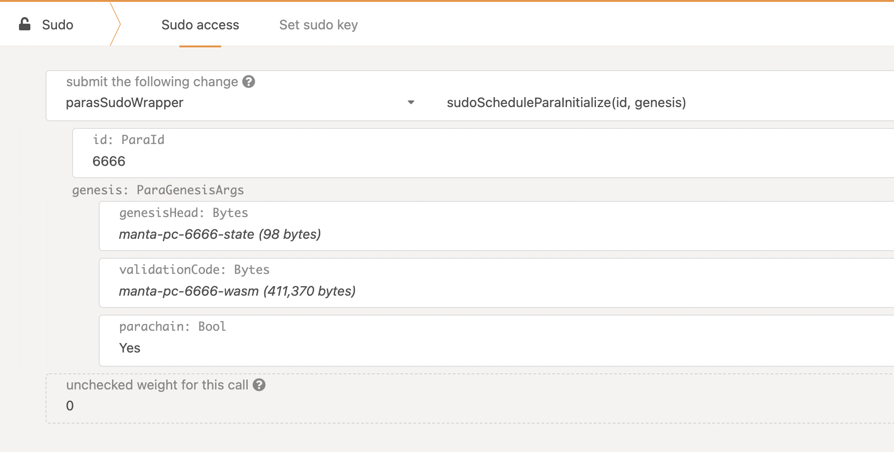

## Manta Parachain Testing

### Relaychain
1. Compile.
```shell
git clone https://github.com/paritytech/polkadot.git
cd polkadot
git checkout release-v0.9.3
cargo build --release
```

2. Generate relaychain chain spec.
```shell
./target/release/polkadot build-spec --chain rococo-local --disable-default-bootnode --raw > rococo.json
```

3. Start two nodes.
- Alice node
```shell
./target/release/polkadot \
--chain rococo-local \
--alice \
--tmp \
--rpc-cors 'all' \
--discover-local \
--unsafe-ws-external
```

- Bob node
```shell
./target/release/polkadot \
--chain rococo-local \
--tmp \
--bob \
--rpc-cors 'all' \
--unsafe-ws-external \
--ws-port 9945 \
--discover-local \
--port 30334
```

### Manta Parachain
1. Compile.
```shell
git clone https://github.com/Manta-Network/Manta.git
cd Manta
git checkout manta-pc
cargo build --release
```

2. Generate genesis state and genesis wasm file.
- Genesis state
```shell
./target/release/manta-pc export-genesis-state --parachain-id 6666 --chain manta-pc-local > manta-pc-6666-state
```

- Genesis wasm
```shell
./target/release/manta-pc export-genesis-wasm --raw --chain manta-pc-local > manta-pc-6666-wasm
```

3. Start Manta Parachain node. The para id is `6666`.
```shell
./target/release/manta-pc \
--tmp \
--chain manta-pc-local \
--ws-port 9946 \
--port 30335 \
--parachain-id 6666 \
--validator \
--alice \
--force-authoring \
-- \
--discover-local \
--chain rococo.json
```
Tips: Now, Manta Parachain is using aura instead of babe, this param is necessary `--force-authoring`.

4. Register Manta Parachain on relaychain. Just follow this screenshot.



After about 2mins, you'll see parachain starts producing blocks.
